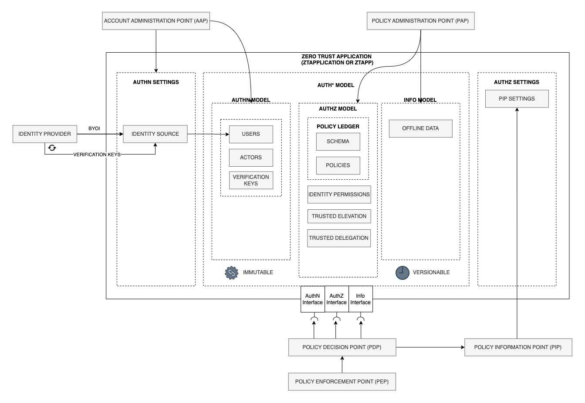

# Identity Actor Model Specification

## 1. Scope and Framework

This specification introduces the `Identity Actor Model`, a core component of the Zero Trust Auth* (`ZTAuth*`) Framework.
It implements the `ZTAuth\*` Architecture to provide a secure, scalable, and organized way to manage authorization, aligning with Zero Trust principles.

The `Identity Actor Model`, also known as the `Actor Model` or simply `Actor`, enables secure, permission-based operations through policies.
It links policies directly to specific authorization contexts, ensuring systems operate with only the minimum permissions required for efficiency and security.

> **Note**: All examples of pseudo-code, JSON, or other formats provided in this document are intended for illustrative purposes only.
> In a real implementation, the actual fields, their names, or the number of fields may vary depending on the specific requirements and design choices.
> These examples are descriptive and should not be considered prescriptive or binding.

### 1.1 Purpose and Scope

The purpose of this specification is to outline how a `Node` can securely act as an `Actor` on behalf of a `Principal`.
It provides clear guidance for both architecture and implementation to enable permissioned operations that fully align with Zero Trust principles, ensuring secure interactions with strictly bounded permissions.

### 1.2 Key Functional Characteristics

The `Identity Actor Model` enhances user, role and group management with:

- **Direct Link Between Identities and `Actor Models`:** Users, roles and groups are mapped directly to `Actor Models`.

- **Customizable `Actor Models`:** Combine `Actor Models` using Union, Intersection, and Difference to support complex permission scenarios.

These features make the `Identity Actor Model` a secure, efficient, scalable, and flexible solution for modern systems.

### 1.3 Underlying Assumptions and Preconditions

`ZTAuth*` assumes that Identity Providers (IdPs) are now the standard and are responsible for managing core identity aspects, such as Users, Roles, and Groups, specifically in the context of Authentication (AuthN) and Identity Management.

`ZTAuth*` primarily focuses on **Zero Trust** security, managing the metadata of identities provided by the IdP and implementing the entire Authorization (AuthZ) layer.

This approach ensures that `ZTAuth*` remains focused and dedicated to authorization within a **Zero Trust** framework, while leveraging the capabilities of Identity Providers to handle authentication and identity management.

### 1.4 Integration with Zero Trust Architecture

The `ZTAuth*` Architecture is outlined below.

For further details, refer to `https://github.com/ztauthstar/ztauthstar-publications`.

